# Understanding Tenstorrent: A Beginner's Guide

**Learn AI accelerator programming through running Zork on Blackhole hardware**

## Who This Guide Is For

This guide is for:
- Software developers new to hardware acceleration
- Students learning about AI accelerators
- Anyone curious about how Zork runs on AI hardware
- Developers with no C++ experience (concepts explained from scratch)

**No prerequisites required!** We'll build understanding from the ground up.

## Table of Contents

1. [The Big Picture](#the-big-picture)
2. [What is an AI Accelerator?](#what-is-an-ai-accelerator)
3. [The Hardware: Tenstorrent Blackhole](#the-hardware-tenstorrent-blackhole)
4. [Memory: Where Data Lives](#memory-where-data-lives)
5. [Kernels: Programs That Run on Accelerators](#kernels-programs-that-run-on-accelerators)
6. [The Network on Chip (NoC)](#the-network-on-chip-noc)
7. [TT-Metal: The Programming Framework](#tt-metal-the-programming-framework)
8. [Zork Example: Step by Step](#zork-example-step-by-step)
9. [Mental Models](#mental-models)
10. [Common Patterns](#common-patterns)

---

## The Big Picture

### What We're Doing

We're running a 1977 video game (Zork) on 2026 AI hardware. This might seem strange, but it's a perfect way to learn because:

1. **Simple program** - Zork is easier to understand than AI models
2. **Real hardware** - Uses the same patterns as AI inference
3. **Concrete results** - We can see actual game text output
4. **Complete example** - Everything needed to learn is here

### The Journey of Data


**In simple terms:**
1. Game file starts on your computer (host)
2. Host sends it to the AI accelerator's memory
3. AI accelerator core copies it to fast local memory
4. Core runs the game (executes Zork instructions)
5. Output goes back to host
6. You see the text!

---

## What is an AI Accelerator?

### CPUs vs AI Accelerators

**Your Computer's CPU** (like Intel or AMD):
- **General purpose** - can do anything
- **Few cores** - typically 4-16 cores
- **Fast per core** - each core is very smart
- **Good at** - running different programs, making decisions

**Tenstorrent AI Accelerator**:
- **Specialized** - designed for AI and parallel computation
- **Many cores** - hundreds of cores on one chip
- **Simple per core** - each core does simpler tasks
- **Good at** - doing the same operation on lots of data at once

### Analogy: Restaurant Kitchen


**CPU Restaurant:**
- Few chefs, but each can cook any dish
- Great when you need different meals
- Each chef makes decisions

**AI Accelerator Factory:**
- Many workers, each specialized
- Great when you need 1000 of the same meal
- Workers follow simple instructions

**For Zork:** We're using one worker (one core) from the factory to run the game!

---

## The Hardware: Tenstorrent Blackhole

### Physical Chip

The Blackhole chip has:
- **Multiple cores** arranged in a grid (x, y coordinates)
- **Each core** has processors and memory
- **Connections** between cores (like highways between cities)


### What's Inside a Core?

Each core has:


**For Zork:**
- We use the **RISC-V processor** (general purpose)
- We use **L1 memory** (fast, small)
- We access **DRAM** through NoC (slow, big)
- We don't use **Tensix** (that's for AI math we don't need)

---

## Memory: Where Data Lives

### The Memory Hierarchy

Think of memory like different types of storage:

```mermaid
graph TD
    subgraph Speed["Speed & Size Trade-off"]
        L1["L1 Memory<br/>⚡ FASTEST<br/>📦 SMALLEST<br/>128 KB per core<br/><br/>Like your desk"]
        DRAM["DRAM<br/>🐌 SLOWER<br/>📦 LARGER<br/>GB per chip<br/><br/>Like filing cabinet"]
        Host["Host Memory<br/>🐌🐌 SLOWEST<br/>📦 LARGEST<br/>GB+ on computer<br/><br/>Like warehouse"]
    end

    L1 --> DRAM --> Host

    style L1 fill:#bfb,stroke:#333,stroke-width:2px
    style DRAM fill:#fbb,stroke:#333,stroke-width:2px
    style Host fill:#ffe,stroke:#333,stroke-width:2px
```



### Real-World Analogy: Office Work

**L1 Memory = Your Desk**
- Super fast to access (just reach out)
- Very limited space (only a few papers fit)
- Private to you (other workers can't see it)

**DRAM = Filing Cabinet**
- Slower (have to walk across room)
- More space (many files)
- Shared (other workers can access it)

**Host Memory = Warehouse**
- Very slow (have to drive there)
- Huge space (unlimited files)
- Managed by different team (your CPU)

### For Zork: Where Things Live


**Step by step:**
1. Host sends game file to DRAM (slow, one-time)
2. Core copies DRAM → L1 (medium speed, per-kernel)
3. Core executes game using L1 data (fast!)
4. Core writes output to L1 (fast!)
5. Core copies L1 → DRAM (medium speed, per-kernel)
6. Host reads from DRAM (slow, one-time)

**Why the complexity?**
- L1 is **10-100× faster** than DRAM
- But L1 is **tiny** (128 KB vs GBs)
- So we copy what we need to L1, work there, then copy back

---

## Kernels: Programs That Run on Accelerators

### What is a Kernel?

**Not** an operating system kernel!

**A kernel is:**
- A small program that runs on an accelerator core
- Usually does one specific task
- Written in C++ (for Tenstorrent)
- Compiled specially for RISC-V processor

### Analogy: Recipe Cards


**Recipe card (kernel):**
- Instructions for what to do
- Chef follows exactly

**Ingredients (input data):**
- What the chef works with
- Provided by manager (host)

**Finished dish (output):**
- Result of following recipe
- Given back to manager

### Kernel Structure

```cpp
// This is pseudo-code to explain, not real C++
void kernel_main() {
    // 1. Get inputs (from L1 or DRAM)
    data = read_from_memory();

    // 2. Do the work
    result = process(data);

    // 3. Write outputs
    write_to_memory(result);
}
```

**Three parts every kernel has:**
1. **Input** - Get the data you need
2. **Compute** - Do the actual work
3. **Output** - Store the results

### Zork Kernel Example

Our Zork kernel does:

```cpp
void kernel_main() {
    // 1. INPUT: Copy game from DRAM to L1
    copy_game_to_L1();

    // 2. COMPUTE: Run 100 Zork instructions
    for (int i = 0; i < 100; i++) {
        execute_one_zork_instruction();
    }

    // 3. OUTPUT: Copy game output from L1 to DRAM
    copy_output_to_DRAM();
}
```

Simple! Just three steps.

---

## The Network on Chip (NoC)

### What is NoC?

NoC is like the **postal service** inside the chip:
- Moves data between cores
- Moves data between cores and DRAM
- Multiple "routes" can happen at once


### NoC Operations

**Reading (like receiving mail):**
```cpp
// Ask NoC to send data from DRAM to L1
noc_async_read(
    from: DRAM_address,
    to: L1_address,
    size: how_many_bytes
);

// Wait for delivery
noc_async_read_barrier();  // "Wait for mail to arrive"
```

**Writing (like sending mail):**
```cpp
// Ask NoC to send data from L1 to DRAM
noc_async_write(
    from: L1_address,
    to: DRAM_address,
    size: how_many_bytes
);

// Wait for delivery
noc_async_write_barrier();  // "Wait for mail to be delivered"
```

### Why "Async"?

**Async** = Asynchronous = "Start it and do other things while waiting"


**Analogy:**
- **Synchronous (sync)** = Stand at mailbox and wait for letter
- **Asynchronous (async)** = Ask for mail delivery, go do other things, check mailbox later

**Why this matters:**
- NoC transfers are **slow** (like waiting for mail)
- Core doesn't want to sit idle
- Start transfer, do other work, then check if done

### Zork NoC Usage

```cpp
// Read game data: DRAM → L1
for (int chunk = 0; chunk < 22; chunk++) {
    uint32_t offset = chunk * 4096;  // 4KB chunks

    // Start the transfer (async)
    noc_async_read(
        DRAM_game_address + offset,
        L1_game_address + offset,
        4096  // bytes
    );

    // Wait for this chunk to arrive
    noc_async_read_barrier();
}

// Now all 22 chunks (88 KB) are in L1, ready to use!
```

**Why chunks?**
- Transferring 88 KB at once might be too much
- Breaking into 4 KB pieces is safer
- Can process each chunk as it arrives

---

## TT-Metal: The Programming Framework

### What is TT-Metal?

TT-Metal is the **toolkit** for programming Tenstorrent hardware:
- Compiles your kernels for RISC-V
- Manages devices (chips)
- Allocates memory (DRAM, L1)
- Launches kernels
- Transfers data


### Host Program vs Kernel

**Two separate programs:**


**Host program:**
- Runs on your computer's CPU
- Orchestrates everything
- Talks to TT-Metal API

**Kernel:**
- Runs on accelerator RISC-V core
- Does the actual computation
- Cannot see host directly

**They communicate through memory:**
- Host writes data to DRAM
- Kernel reads from DRAM
- Kernel writes results to DRAM
- Host reads results from DRAM

### Key TT-Metal Concepts

#### 1. Device

The physical chip:
```cpp
// Create a connection to device 0
auto device = create_device(0);

// When done
close_device(device);
```

**Analogy:** Opening a connection to a printer

#### 2. Buffer

Allocated memory on the device:
```cpp
// Allocate 128 KB in DRAM
auto buffer = create_buffer(
    device,
    size: 128 * 1024,  // bytes
    type: DRAM
);
```

**Analogy:** Reserving a parking space

#### 3. Program

Container for kernels:
```cpp
// Create empty program
auto program = CreateProgram();

// Add kernel to it
auto kernel = CreateKernel(
    program,
    "path/to/kernel.cpp",
    core_coordinates,
    config
);
```

**Analogy:** Creating a to-do list, adding tasks to it

#### 4. Workload

Bundled programs to execute:
```cpp
// Create workload
MeshWorkload workload;
workload.add_program(device_range, program);

// Execute it
EnqueueMeshWorkload(queue, workload, blocking);
```

**Analogy:** Giving the to-do list to workers, telling them to start

---

## Zork Example: Step by Step

Let's walk through **exactly** how Zork runs, step by step.

### Step 1: Initialize Device

```cpp
// Host program creates connection to device 0
auto mesh_device = MeshDevice::create_unit_mesh(0);
```


**What happens:**
- TT-Metal finds device 0 on PCIe bus
- Initializes firmware
- Sets up communication channels
- Returns a "handle" (like a phone number) to talk to device

**Time:** ~3 seconds (slow, but only once!)

### Step 2: Allocate Buffers

```cpp
// Allocate space for game file (128 KB)
auto game_buffer = MeshBuffer::create(
    size: 128 * 1024,
    type: DRAM
);

// Allocate space for output (16 KB)
auto output_buffer = MeshBuffer::create(
    size: 16 * 1024,
    type: DRAM
);
```


**What happens:**
- TT-Metal finds free space in DRAM
- Marks those regions as "in use"
- Returns addresses (like street addresses)
- No data copied yet, just reserved

**Time:** ~0.5 seconds

### Step 3: Upload Game Data

```cpp
// Read game file from disk
std::vector<uint8_t> game_data = load_file("zork1.z3");

// Upload to DRAM
EnqueueWriteMeshBuffer(
    command_queue,
    game_buffer,
    game_data,
    blocking: true  // Wait for upload to finish
);
```


**What happens:**
1. Host reads zork1.z3 from disk into RAM
2. Host sends data over PCIe bus to device
3. Data is written to DRAM buffer at address 0x493e40
4. Host waits until transfer completes

**Time:** ~0.5 seconds (86 KB over PCIe)

### Step 4: Create Kernel

```cpp
// Create program container
Program program = CreateProgram();

// Specify which DRAM buffers kernel will use
std::map<std::string, std::string> defines;
defines["GAME_DRAM_ADDR"] = "0x493e40";
defines["OUTPUT_DRAM_ADDR"] = "0x4b3e40";

// Create kernel for core (0,0)
KernelHandle kernel = CreateKernel(
    program,
    "/path/to/zork_interpreter_opt.cpp",
    CoreCoord{0, 0},  // Which core
    DataMovementConfig{
        .processor = RISCV_0,
        .noc = RISCV_0_default,
        .defines = defines
    }
);
```


**What happens:**
1. TT-Metal reads kernel source file
2. Compiles C++ to RISC-V machine code
3. Injects buffer addresses as compile-time constants
4. Creates executable binary
5. Stores in Program object (not uploaded to device yet)

**Time:** ~0.1 seconds (program cache helps!)

### Step 5: Launch Kernel

```cpp
// Create workload
MeshWorkload workload;
workload.add_program(device_range, program);

// Launch it (non-blocking)
EnqueueMeshWorkload(command_queue, workload, false);

// Wait for completion
Finish(command_queue);
```


**What happens:**
1. Host tells TT-Metal to run the workload
2. TT-Metal uploads kernel binary to core (0,0)
3. Core starts executing kernel_main()
4. Host waits for core to finish
5. Core signals completion

**Time:** ~0.5 seconds (kernel execution)

### Step 6: Kernel Execution

**This is what happens ON THE CORE while host is waiting:**

```cpp
// Running on RISC-V core at (0,0)
void kernel_main() {
    // Phase 1: NoC Read (DRAM → L1)
    uint32_t game_addr = 0x493e40;  // From defines
    uint32_t L1_game_addr = 0x20000;  // L1 address

    for (int chunk = 0; chunk < 22; chunk++) {
        noc_async_read(
            game_addr + chunk * 4096,
            L1_game_addr + chunk * 4096,
            4096
        );
        noc_async_read_barrier();
    }

    // Phase 2: Compute (run Zork)
    initialize_zmachine(L1_game_addr);

    for (int i = 0; i < 100; i++) {
        execute_one_zork_instruction();
    }

    // Phase 3: NoC Write (L1 → DRAM)
    uint32_t output_addr = 0x4b3e40;  // From defines
    uint32_t L1_output_addr = 0x40000;  // L1 address

    noc_async_write(
        L1_output_addr,
        output_addr,
        16 * 1024
    );
    noc_async_write_barrier();
}
```


**Breakdown:**

**Phase 1 (Input - ~0.1s):**
- Copy 88 KB game data from DRAM to L1
- Uses 22 chunks of 4 KB each
- NoC transfers while core waits

**Phase 2 (Compute - ~0.3s):**
- Initialize Z-machine interpreter
- Execute 100 Zork instructions
- All reads/writes use fast L1 memory
- This is where the actual game runs!

**Phase 3 (Output - ~0.1s):**
- Copy 16 KB output buffer from L1 to DRAM
- Single transfer
- NoC write while core waits

**Total kernel time:** ~0.5 seconds

### Step 7: Read Results

```cpp
// Allocate host memory for output
std::vector<char> output_data(16 * 1024);

// Read from device DRAM to host memory
EnqueueReadMeshBuffer(
    command_queue,
    output_data,
    output_buffer,
    blocking: true
);
```


**What happens:**
1. Host asks for data from DRAM buffer
2. Device sends 16 KB over PCIe
3. Data written to host memory vector
4. Host waits until transfer completes

**Time:** ~0.1 seconds

### Step 8: Display Output

```cpp
// Print the Zork output
std::cout << "╔═══════════════════════════════╗" << std::endl;
std::cout << "║  ZORK OUTPUT FROM RISC-V     ║" << std::endl;
std::cout << "╠═══════════════════════════════╣" << std::endl;
std::cout << output_data.data() << std::endl;
std::cout << "╚═══════════════════════════════╝" << std::endl;
```

**Output you see:**
```
╔═══════════════════════════════╗
║  ZORK OUTPUT FROM RISC-V     ║
╠═══════════════════════════════╣

ZORK I: The Great Underground Empire
Infocom interactive fiction - a fantasy story
© Infocom, Inc. All rights reserved.
ZORK is a registered trademark of Infocom, Inc.

╚═══════════════════════════════╝
```

**Success!** Real Zork text from RISC-V core!

### Complete Timeline


**Total time:** ~4.7 seconds for single batch
**Kernel time:** ~0.5 seconds (the actual work)
**Overhead:** ~4.2 seconds (device init, data transfer)

---

## Mental Models

### Model 1: The Factory Assembly Line


**Mental model:**
- **Manager (Host):** Decides what to make, provides materials
- **Warehouse (DRAM):** Stores raw materials and finished goods
- **Truck (NoC):** Moves things between warehouse and workbench
- **Workbench (L1):** Where worker actually works (small but organized)
- **Worker (RISC-V):** Does the actual work, needs everything at workbench

**Key insight:** Worker is fastest when everything is on their workbench (L1). Going to warehouse (DRAM) is slow.

### Model 2: The Chef and Kitchen

```mermaid
graph TB
    subgraph Restaurant["Restaurant = AI Accelerator"]
        Storage[DRAM<br/>Storage Room<br/>All ingredients]
        Cart[NoC<br/>Kitchen cart<br/>Transport]
        Counter[L1<br/>Prep counter<br/>Active ingredients]
        Chef[RISC-V<br/>Chef<br/>Cooks]

        Storage -->|Fetch| Cart
        Cart -->|Stage| Counter
        Counter -->|Cook with| Chef
        Chef -->|Plate on| Counter
        Counter -->|Return via| Cart
        Cart -->|Store| Storage
    end

    Manager2[Host<br/>Restaurant manager] -->|Stock| Storage
    Storage -->|Serve| Manager2

    style Chef fill:#bbf,stroke:#333,stroke-width:4px
```

**Mental model:**
- **Manager (Host):** Orders supplies, serves customers
- **Storage room (DRAM):** All ingredients stored here
- **Kitchen cart (NoC):** Brings ingredients to counter
- **Prep counter (L1):** Chef's workspace (limited space!)
- **Chef (RISC-V):** Cooks the meal, needs everything within reach

**Key insight:** Chef can't cook if ingredients are in storage room. Must bring to counter first.

### Model 3: The Office Worker

```mermaid
graph TB
    subgraph Office["Office = AI Accelerator"]
        FileRoom[DRAM<br/>File Room<br/>All documents]
        MailCart[NoC<br/>Mail Cart<br/>Delivery]
        Desk[L1<br/>Desk<br/>Current work]
        Worker2[RISC-V<br/>Office worker<br/>Does work]

        FileRoom -->|Deliver| MailCart
        MailCart -->|Place on| Desk
        Desk -->|Work on| Worker2
        Worker2 -->|Complete| Desk
        Desk -->|Send via| MailCart
        MailCart -->|File| FileRoom
    end

    Boss[Host<br/>Boss] -->|Assign| FileRoom
    FileRoom -->|Report| Boss

    style Worker2 fill:#bbf,stroke:#333,stroke-width:4px
```

**Mental model:**
- **Boss (Host):** Assigns work, reviews results
- **File room (DRAM):** All documents archived here
- **Mail cart (NoC):** Brings files to/from desk
- **Desk (L1):** Worker's active workspace (limited space!)
- **Office worker (RISC-V):** Does the work, needs files on desk

**Key insight:** Worker is most productive with current files on desk. Walking to file room kills productivity.

---

## Common Patterns

### Pattern 1: Single-Shot Execution

**Use case:** Run kernel once, get results

```mermaid
sequenceDiagram
    participant Host
    participant Device

    Host->>Device: Initialize
    Host->>Device: Allocate buffers
    Host->>Device: Upload data
    Host->>Device: Launch kernel
    Device->>Device: Execute
    Host->>Device: Read results
    Host->>Device: Close
```

**Pros:**
- Simple
- Easy to understand
- Good for one-time tasks

**Cons:**
- Device init/close is slow (3+ seconds)
- Can't reuse device for more work

**Example:** Our single-shot `zork_on_blackhole.cpp`

### Pattern 2: Device Persistence (Batching)

**Use case:** Run multiple kernels without closing device

```mermaid
sequenceDiagram
    participant Host
    participant Device

    Host->>Device: Initialize (once)
    Host->>Device: Allocate buffers (once)
    Host->>Device: Upload data (once)

    loop For each batch
        Host->>Device: Launch kernel
        Device->>Device: Execute
        Host->>Device: Read results
    end

    Host->>Device: Close (once)
```

**Pros:**
- 4× faster (amortize init/close)
- Can process more data
- Device stays "warm"

**Cons:**
- More complex host code
- Need to manage state

**Example:** Our `test_zork_optimized.cpp` (5 batches)

**Performance:**
- Single-shot: 3s init + 0.5s execute + 0.1s close = 3.6s
- Batched (5×): 3s init + 5×0.5s execute + 0.1s close = 5.6s
- **Savings:** 18s - 5.6s = 12.4s (4× speedup for 5 batches)

### Pattern 3: Streaming Data

**Use case:** Continuous data processing

```mermaid
graph LR
    subgraph Loop["Continuous Loop"]
        Upload[Upload chunk N]
        Process[Process chunk N]
        Download[Download result N]

        Upload --> Process --> Download --> Upload
    end

    style Loop fill:#eff,stroke:#333,stroke-width:2px
```

**Pros:**
- Handle unlimited data
- Memory efficient (one chunk at a time)
- Good for real-time processing

**Cons:**
- Complex synchronization
- Need careful buffer management

**Example:** What we'd use for interactive Zork gameplay

### Pattern 4: Parallel Execution

**Use case:** Use multiple cores at once

```mermaid
graph TB
    Host[Host] --> Core00[Core 0,0<br/>Process chunk 1]
    Host --> Core01[Core 0,1<br/>Process chunk 2]
    Host --> Core02[Core 0,2<br/>Process chunk 3]
    Host --> Core03[Core 0,3<br/>Process chunk 4]

    Core00 --> Results[Combine results]
    Core01 --> Results
    Core02 --> Results
    Core03 --> Results

    style Host fill:#ffe,stroke:#333,stroke-width:2px
    style Results fill:#bfb,stroke:#333,stroke-width:2px
```

**Pros:**
- Massive speedup (4 cores = 4× faster)
- Utilize full chip capacity
- Good for data parallel tasks

**Cons:**
- Complex orchestration
- Need independent work chunks
- Synchronization overhead

**Example:** Future enhancement for Zork (not implemented yet)

---

## Practical Tips for Learning

### Start Small

1. **Read working examples** (like our Zork code)
2. **Make tiny changes** (e.g., change 100 to 50)
3. **Rebuild and test** (see what happens)
4. **Add print statements** (understand flow)
5. **Gradually increase complexity**

### Debugging Strategies

**Problem: Kernel times out**
```mermaid
graph TD
    Timeout[Kernel Timeout]

    Timeout -->|Check 1| Loop[Are you in infinite loop?]
    Timeout -->|Check 2| Long[Is execution too long?]
    Timeout -->|Check 3| Barrier[Forgot NoC barrier?]

    Loop -->|Fix| LoopFix[Add loop counter limit]
    Long -->|Fix| LongFix[Reduce batch size]
    Barrier -->|Fix| BarrierFix[Add noc_async_read/write_barrier]

    style Timeout fill:#fbb,stroke:#333,stroke-width:2px
```

**Problem: Wrong output**
```mermaid
graph TD
    Wrong[Wrong Output]

    Wrong -->|Check 1| Addr[Are DRAM addresses correct?]
    Wrong -->|Check 2| Size[Are buffer sizes correct?]
    Wrong -->|Check 3| Copy[Did NoC transfer complete?]

    Addr -->|Fix| AddrFix[Verify buffer addresses]
    Size -->|Fix| SizeFix[Check size matches allocated]
    Copy -->|Fix| CopyFix[Add barriers, check status]

    style Wrong fill:#fbb,stroke:#333,stroke-width:2px
```

**Problem: Performance is slow**
```mermaid
graph TD
    Slow[Slow Performance]

    Slow -->|Check 1| InitClose[Opening device each time?]
    Slow -->|Check 2| Transfer[Too much DRAM↔L1 transfer?]
    Slow -->|Check 3| L1[Not using L1 memory?]

    InitClose -->|Fix| Batch[Use device persistence]
    Transfer -->|Fix| Reduce[Reduce transfer size/frequency]
    L1 -->|Fix| UseL1[Copy to L1 once, use many times]

    style Slow fill:#fef,stroke:#333,stroke-width:2px
```

### Common Pitfalls

**Pitfall 1: Forgetting barriers**
```cpp
// WRONG - might use data before transfer complete
noc_async_read(DRAM_addr, L1_addr, size);
use_data(L1_addr);  // ❌ Data might not be ready!

// RIGHT - wait for transfer
noc_async_read(DRAM_addr, L1_addr, size);
noc_async_read_barrier();  // ✅ Wait for data
use_data(L1_addr);  // ✅ Now safe to use
```

**Pitfall 2: Using DRAM addresses from kernel**
```cpp
// WRONG - DRAM is slow, kernel can't see it directly
zbyte* memory = (zbyte*)DRAM_address;  // ❌ Wrong!
memory[0] = value;  // ❌ Won't work!

// RIGHT - copy to L1 first
noc_async_read(DRAM_address, L1_address, size);
noc_async_read_barrier();
zbyte* memory = (zbyte*)L1_address;  // ✅ L1 address
memory[0] = value;  // ✅ Works!
```

**Pitfall 3: L1 memory is too small**
```cpp
// WRONG - trying to allocate 10 MB in L1
uint8_t big_array[10 * 1024 * 1024];  // ❌ Won't fit!

// RIGHT - use L1 for active data, DRAM for bulk
// Keep only current chunk in L1
uint8_t chunk[4096];  // ✅ 4 KB fits easily
// Process in chunks from DRAM
```

---

## Glossary

**AI Accelerator:** Specialized hardware designed for AI/ML workloads, has many cores optimized for parallel computation.

**RISC-V:** A type of processor architecture (like ARM or x86). Open-source, simple, used in Tenstorrent cores.

**Core:** One processing unit on the chip. Like one worker in a factory. Located at (x, y) coordinates.

**Tensix:** Tenstorrent's custom processor design for AI math. Each core has Tensix + RISC-V.

**Kernel:** Small program that runs on an accelerator core. Not an OS kernel! Think "recipe card."

**Host:** Your computer's main CPU (x86/ARM) that orchestrates everything.

**Device:** The AI accelerator chip. Connected to host via PCIe.

**DRAM:** Device RAM. Large (GBs), slow, shared memory on the accelerator.

**L1 Memory:** Small (128 KB), fast, private memory on each core.

**NoC (Network on Chip):** Internal network connecting cores and DRAM. Like postal service inside chip.

**TT-Metal:** Tenstorrent's programming framework. APIs for managing device, memory, kernels.

**Buffer:** Allocated memory region on device. Has address and size.

**Program:** Container for one or more kernels to execute.

**Workload:** Set of programs to run. Can span multiple devices.

**Barrier:** Synchronization point. "Wait until this operation finishes."

**Async (Asynchronous):** "Start this and keep going, don't wait."

**Sync (Synchronous):** "Do this and wait until it's done."

**Batch:** Group of work items processed together. Like processing 5 kernels without closing device.

---

## Further Learning

### Explore Our Code

**Start here:**
1. `zork_on_blackhole.cpp` - Simple host program
2. `kernels/zork_interpreter_opt.cpp` - Kernel code (look at kernel_main)
3. `test_zork_optimized.cpp` - Batched execution example

**Experiments to try:**
1. Change interpret(100) to interpret(50) - see if it still works
2. Change num_batches from 5 to 10 - see double output
3. Add your own print statements - understand flow
4. Measure timing with std::chrono - profile performance

### TT-Metal Documentation

- [TT-Metal GitHub](https://github.com/tenstorrent/tt-metal)
- [Programming Guide](https://github.com/tenstorrent/tt-metal/tree/main/docs)
- [API Reference](https://github.com/tenstorrent/tt-metal/tree/main/tt_metal/include)

### Related Concepts

**If you want to learn more about:**

**Hardware:**
- Read about RISC-V architecture
- Learn about memory hierarchies (L1, L2, L3 caches)
- Understand PCIe (how host talks to device)

**Parallel Programming:**
- Study CUDA (NVIDIA's framework - similar concepts)
- Read about OpenCL (portable parallel programming)
- Learn about data parallelism vs task parallelism

**Optimization:**
- Cache-friendly algorithms
- Minimizing data movement
- Batching strategies

---

## Conclusion

### What You've Learned

✅ **What** an AI accelerator is (specialized parallel hardware)
✅ **How** Tenstorrent Blackhole is organized (cores, memory, NoC)
✅ **Why** we have multiple memory types (L1 fast/small, DRAM slow/big)
✅ **What** kernels are (programs for accelerator cores)
✅ **How** data moves (NoC transfers, async operations)
✅ **What** TT-Metal does (framework for programming hardware)
✅ **How** Zork runs on hardware (complete example with diagrams)

### Key Takeaways

1. **Memory hierarchy matters:** Fast L1 for active data, DRAM for bulk storage
2. **NoC is the bottleneck:** Minimize transfers, use barriers correctly
3. **Batching is powerful:** Amortize init/close overhead across multiple kernels
4. **Think parallel:** Hardware is designed for many small tasks, not one big task
5. **Start simple:** Understand patterns before optimizing

### Why This Matters

You now understand how modern AI hardware works at a fundamental level. The patterns you've learned apply to:

- **AI inference** (running neural networks)
- **Training** (machine learning)
- **Scientific computing** (simulations)
- **Data processing** (analytics)
- **Classic gaming** (Zork!)

The same concepts (host/device, kernels, memory hierarchy, batching) appear everywhere in hardware acceleration.

### Next Steps

1. **Experiment:** Modify our Zork code, see what happens
2. **Read:** TT-Metal documentation and examples
3. **Build:** Try your own simple kernel (hello world, add arrays, etc.)
4. **Optimize:** Make Zork run faster or support more features
5. **Share:** Teach others what you've learned!

---

## Appendix: Code Comments Explained

### Example: Kernel with Annotations

```cpp
// This runs on RISC-V core at (0,0)
void kernel_main() {

    // ============================================
    // PHASE 1: INPUT - Get data from DRAM
    // ============================================

    // These are compile-time constants from host
    // Host injects these when compiling kernel
    uint32_t game_dram = GAME_DRAM_ADDR;  // e.g., 0x493e40
    uint32_t output_dram = OUTPUT_DRAM_ADDR;  // e.g., 0x4b3e40

    // These are L1 addresses (fast local memory)
    // We choose these, they're like variables
    uint32_t game_L1 = 0x20000;    // Start of L1 for game
    uint32_t output_L1 = 0x40000;  // Start of L1 for output

    // Copy game file from DRAM to L1
    // We do this in chunks because:
    // 1. Safer (less likely to fail)
    // 2. Can verify each chunk
    // 3. Standard pattern in examples
    for (int chunk = 0; chunk < 22; chunk++) {
        uint32_t offset = chunk * 4096;  // Each chunk is 4KB

        // Start NoC transfer (async = non-blocking)
        noc_async_read(
            game_dram + offset,   // Source: DRAM address
            game_L1 + offset,     // Destination: L1 address
            4096                  // Size: 4 KB
        );

        // Wait for this chunk to arrive (barrier = wait point)
        // This blocks until NoC finishes transfer
        noc_async_read_barrier();
    }

    // Now all game data is in L1 memory, ready to use!

    // ============================================
    // PHASE 2: COMPUTE - Do the actual work
    // ============================================

    // Cast L1 address to pointer
    // Now we can read game data like normal memory
    zbyte* memory = (zbyte*)game_L1;
    char* output = (char*)output_L1;

    // Initialize Z-machine interpreter
    // This sets up PC, stack, variables, etc.
    pc = read_word(0x06);  // Read starting PC from header
    sp = 0;                // Empty stack
    // ... more initialization ...

    // Execute 100 Z-machine instructions
    // This is where Zork actually runs!
    for (int count = 0; count < 100; count++) {
        zbyte opcode = memory[pc++];  // Fetch instruction
        decode_and_execute(opcode);    // Run it

        if (finished) break;  // Game returned, stop
    }

    // At this point, output buffer has game text

    // ============================================
    // PHASE 3: OUTPUT - Send results back
    // ============================================

    // Copy output from L1 to DRAM
    // Host will read it from DRAM
    noc_async_write(
        output_L1,      // Source: L1 output buffer
        output_dram,    // Destination: DRAM output buffer
        16 * 1024       // Size: 16 KB
    );

    // Wait for write to complete
    noc_async_write_barrier();

    // Kernel finished! Core signals completion to host
}
```

**Understanding this code:**

1. **Addresses are numbers:** 0x493e40 is just a memory location, like a street address
2. **Pointers are variables holding addresses:** `zbyte* memory` holds address of game data
3. **Chunks reduce risk:** 22 × 4KB = 88 KB, safer than one big 88 KB transfer
4. **Barriers are checkpoints:** "Wait here until NoC finishes"
5. **Three phases pattern:** Input → Compute → Output (standard structure)

### Example: Host Program with Annotations

```cpp
// This runs on your computer's CPU (x86/ARM)
int main() {

    // ============================================
    // SETUP: Prepare everything
    // ============================================

    // Connect to device 0 (first Blackhole chip)
    // This initializes firmware, sets up PCIe, etc.
    auto device = MeshDevice::create_unit_mesh(0);

    // Load game file from disk into host memory
    std::vector<uint8_t> game_data = load_file("game/zork1.z3");
    // game_data is now in YOUR computer's RAM

    // ============================================
    // MEMORY: Allocate space on device
    // ============================================

    // Ask device to reserve 128 KB in DRAM
    auto game_buffer = MeshBuffer::create(
        device,
        128 * 1024,  // Size in bytes
        BufferType::DRAM
    );
    // Returns: "I reserved address 0x493e40 for you"

    // Ask device to reserve 16 KB in DRAM
    auto output_buffer = MeshBuffer::create(
        device,
        16 * 1024,
        BufferType::DRAM
    );
    // Returns: "I reserved address 0x4b3e40 for you"

    // ============================================
    // UPLOAD: Send data to device
    // ============================================

    // Copy game_data from host RAM to device DRAM
    EnqueueWriteMeshBuffer(
        command_queue,
        game_buffer,      // Where on device
        game_data,        // What to send (from host)
        true              // true = wait until done
    );
    // After this: game data is on device at 0x493e40

    // ============================================
    // KERNEL: Compile and prepare
    // ============================================

    // Create program container
    Program program = CreateProgram();

    // Tell compiler the DRAM addresses
    std::map<std::string, std::string> defines;
    defines["GAME_DRAM_ADDR"] = "0x493e40";
    defines["OUTPUT_DRAM_ADDR"] = "0x4b3e40";

    // Compile kernel for core (0,0)
    KernelHandle kernel = CreateKernel(
        program,
        "kernels/zork_interpreter_opt.cpp",  // Source file
        CoreCoord{0, 0},                     // Which core
        DataMovementConfig{
            .processor = RISCV_0,            // Use RISC-V
            .defines = defines               // Inject addresses
        }
    );

    // ============================================
    // EXECUTE: Run the kernel
    // ============================================

    // Create workload
    MeshWorkload workload;
    workload.add_program(device_range, program);

    // Tell device to run it
    EnqueueMeshWorkload(command_queue, workload, false);

    // Wait for kernel to finish
    Finish(command_queue);
    // Kernel has now run! Output is in DRAM at 0x4b3e40

    // ============================================
    // DOWNLOAD: Get results
    // ============================================

    // Allocate space in host memory
    std::vector<char> output_data(16 * 1024);

    // Copy from device DRAM to host RAM
    EnqueueReadMeshBuffer(
        command_queue,
        output_data,      // Where in host memory
        output_buffer,    // Where on device
        true              // true = wait until done
    );

    // ============================================
    // DISPLAY: Show the results
    // ============================================

    // output_data now contains Zork text!
    std::cout << output_data.data() << std::endl;

    // Prints:
    // ZORK I: The Great Underground Empire
    // Infocom interactive fiction - a fantasy story
    // ...

    // ============================================
    // CLEANUP: Free resources
    // ============================================

    device->close();

    return 0;
}
```

**Understanding this code:**

1. **Host orchestrates:** You're the director, device is the actor
2. **Addresses are returned:** create_buffer() gives you addresses to use
3. **Defines inject values:** Compiler replaces GAME_DRAM_ADDR with actual number
4. **Enqueue means "schedule":** Like adding tasks to a to-do list
5. **Finish means "wait":** Block until all tasks complete
6. **Buffers are just addresses:** game_buffer is really just 0x493e40

---

**You've completed the beginner's guide!**

You now understand how Tenstorrent hardware works, how to program it, and how Zork runs on AI accelerator silicon. The patterns and concepts you've learned here apply broadly to parallel computing and hardware acceleration.

**Welcome to the world of AI accelerator programming!** 🚀

*"Any sufficiently advanced technology is indistinguishable from magic... until you understand how it works."* - Arthur C. Clarke (adapted)
